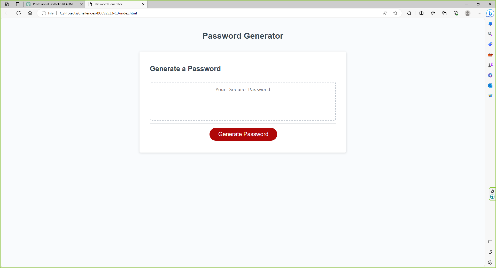

# Random Password Generator

This meticulously crafted webpage is a robust random password generator that empowers users to create customized passwords based on their specific requirements. It accommodates a wide range of criteria, including lower case letters, upper case letters, numbers, and special characters, either individually or in various combinations. With the flexibility to support password lengths ranging from 8 to 128 characters, this tool ensures that you can generate passwords suitable for various security needs. Whether you require a strong, complex password or a longer passphrase for added security, this generator is designed to meet your diverse password creation needs. Simply follow the prompts and select your desired criteria to generate a password that aligns perfectly with your security requirements.

## Installation

N/A

## Usage

When you click on the "Generate Password" button, you'll initiate a process that presents a series of prompts, enabling you to customize the criteria for your password. You can choose from lower case letters, upper case letters, numbers, and special characters individually or in various combinations, tailoring your password to your specific security needs. Additionally, you will be prompted to specify the desired password length, ranging from 8 to 128 characters. It's important to note that if you don't select any criteria or choose a password length 8 characters and above or 128 characters or less, the generator will guide you with a series of prompts until you provide valid input. This user-friendly tool ensures that you can create passwords that precisely match your security requirements.

## Credits

N/A

## License

Please refer to the LICENSE in the repo.

## Webpage URL

## Screenshot

